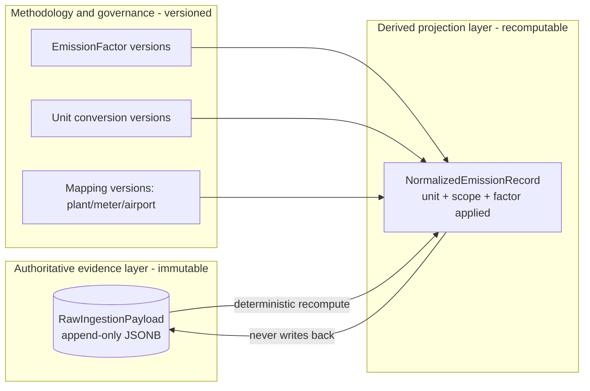
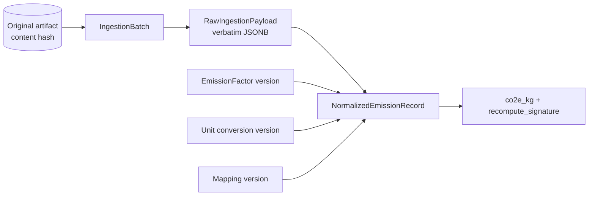
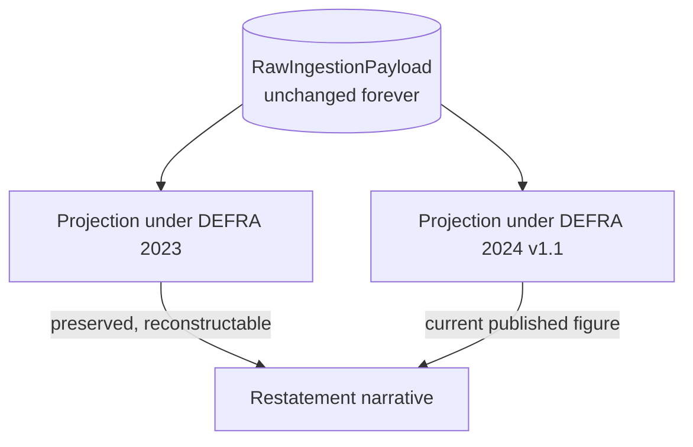
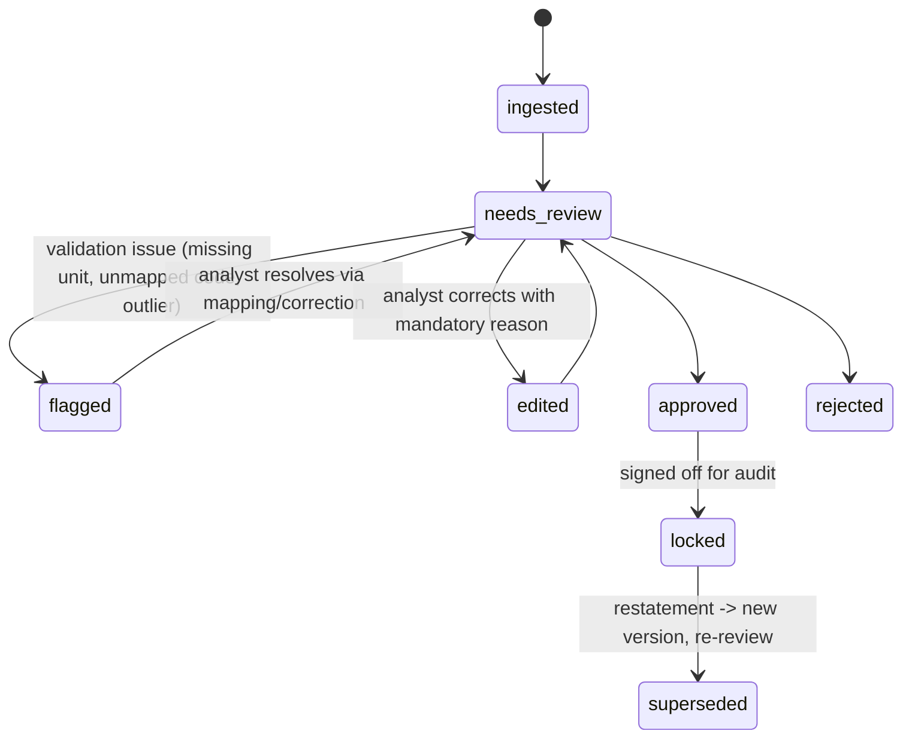

# MODEL.md — Data Model for a Regulatory-Grade ESG Data Platform

> Scope of this document: the data model and the reasoning behind it. It is written to be
> defended in a senior review and to survive an external assurance audit (limited or
> reasonable assurance under ISAE 3000 / the kind of review a CSRD or SEC climate filing
> attracts). It does not describe UI, transport, or deployment except where those touch the
> integrity of the record.

---

## 1. The central architectural decision

Every other choice in this platform is downstream of one decision:

**There are two kinds of data in this system, and they must never be the same table, the same
lifecycle, or the same authority.**

- **`RawIngestionPayload`** — the *evidence*. Exactly what a client system produced: the SAP
  export row, the utility bill line, the travel itinerary segment. Append-only, immutable,
  JSONB-backed, and the **single authoritative source of truth**.
- **`NormalizedEmissionRecord`** — the *interpretation*. A derived projection computed from raw
  evidence: a unit-normalized, scope-categorized, factor-applied emissions figure that an
  analyst reviews and an auditor relies on.

The authoritative record is the evidence, **not** the number we report. The reported number is
a *function of* the evidence plus a methodology plus a factor set, all of which are versioned.
This inversion — evidence is truth, the business record is a recomputable view — is the spine
of the whole platform.

This is not event sourcing for its own sake. The reason is specific to emissions accounting:
**the numbers we publish today will be re-examined, challenged, and recalculated years later,
under methodologies and emission factors that did not exist when the data arrived, and we must
be able to reproduce or restate any figure without having altered what the client originally
sent us.**

The arrow from raw to normalized is one-directional and pure. Normalization reads evidence and
produces records; it can never write back into evidence. That single constraint is what makes
every audit, replay, and restatement claim in this document true.

---

## 2. Why raw evidence and normalized business records must be separated

The naive design is one table: parse the client file, write rows with `quantity`, `unit`,
`co2e`, `scope`, and a `source` string. It works in a demo and fails an audit on first contact.
Here is what separation buys, framed in compliance terms rather than engineering aesthetics.

**1. The evidence and the interpretation have different owners of truth.**
The client owns the evidence — it is *their* meter read, *their* purchase order. We own the
interpretation — the unit conversion, the scope classification, the factor choice. Collapsing
them means an analyst correcting our interpretation silently overwrites the client's stated
fact. An auditor's first question is "what did the source actually say, before anyone touched
it?" If that question has no answer, the assurance engagement stops. A combined table cannot
answer it; the moment you edit a value you have destroyed the only copy of the original.

**2. Interpretations change far more often than evidence does.**
A 2023 electricity bill is a fixed fact forever. But the emission factor for that grid region,
the GHG Protocol guidance on market-based reporting, our airport-distance methodology, and our
plant-to-facility mapping all change repeatedly over the life of that fact. If the number lives
in the same row as the evidence, every methodology change is a destructive in-place update to
the authoritative record. Separation lets evidence sit still while interpretation moves.

**3. Restatement is a first-class regulatory event, not an error path.**
ESG figures get restated — a factor was revised, a boundary was redrawn, a client found a
double-counted facility. Regulators expect restatements to be *explained*, not hidden. With a
combined table, a restatement is an `UPDATE` that erases the prior figure. With separation, a
restatement is a *new projection* over *unchanged evidence*, and both the old and new figures
remain reconstructable. The difference is the difference between "we corrected our books and can
show you exactly why" and "the number changed and we can't prove it wasn't tampering."

**4. The evidence layer is the chain of custody; the projection layer is the work product.**
Auditors assess these differently. The evidence layer must be tamper-evident and complete. The
projection layer must be *defensible* — correct methodology, correct factors, reviewed by a
competent person. Putting them in one table forces both standards onto one object and satisfies
neither.

The separation is therefore not normalization-for-cleanliness. It is the structural
precondition for being audit-grade at all.

---

## 3. `RawIngestionPayload` — the immutable evidence ledger

### 3.1 What it is

One `RawIngestionPayload` row = one atomic unit of evidence exactly as received, before any
interpretation. For a SAP export that is one purchase-order/material line; for a utility export
one bill line; for a travel feed one itinerary segment. The original file (byte-for-byte) is
stored alongside in object storage and referenced by content hash, so the payload row and the
original document are both preserved — the row for queryability, the file for "show me the
literal artifact."

### 3.2 Essential fields (conceptual, not DDL)

- **`id`** — surrogate identity.
- **`organization_id`** — tenant owner of the evidence (see §10).
- **`ingestion_batch_id`** — the upload/pull this row arrived in.
- **`source_system`** — `sap` | `utility` | `travel` (extensible).
- **`source_row_index`** — position within the original file, so evidence maps back to a literal
  line in a literal document.
- **`payload`** — **JSONB**: the verbatim record. SAP German headers, decimal commas, blank
  tariff strings, missing distances — all preserved exactly as sent, including the keys we don't
  understand yet.
- **`file_content_hash`** — SHA-256 of the original artifact; gives duplicate detection and ties
  the row to the stored original.
- **`received_at`**, **`received_by`** — when and by whom the evidence entered custody.
- **`payload_hash`** — SHA-256 of the canonicalized JSONB, the integrity anchor for this row.

### 3.3 Append-only and immutable — and why it is enforced, not trusted

Raw records are **never updated and never deleted.** This is enforced at the database layer (a
guard that rejects `UPDATE`/`DELETE` on the evidence table outside migrations), not merely
respected by application convention. The reasoning is custody: a chain of custody that depends
on every developer remembering not to mutate a table is not a chain of custody. If a client
sends corrected data, that is a *new* batch of *new* evidence with its own timestamp — the
prior evidence remains, and the relationship between the superseded and superseding evidence is
itself recorded. "The client revised this" is a fact worth auditing, not a reason to erase.

### 3.4 Why JSONB specifically

The three sources have irreconcilable shapes, and we deliberately refuse to force them into a
columnar schema at ingestion time, because doing so would mean *interpreting evidence before
storing it* — exactly the coupling we are trying to avoid. JSONB lets us store the source's
reality losslessly (including fields we have no mapping for yet) while remaining queryable for
reprocessing. A field we ignore today but need in two years (a SAP cost center, a travel fare
class nuance) is already preserved, so a future methodology can use it **without re-requesting
data from the client.** That is the difference between a platform that can adopt a new
methodology retroactively and one that has to apologize to clients for lost detail.

---

## 4. `NormalizedEmissionRecord` — the derived projection

### 4.1 What it is

A `NormalizedEmissionRecord` is the business-meaningful, audit-facing emissions figure derived
from one (occasionally several) raw payloads. It is a **projection**: fully determined by its
inputs, and reproducible by re-running normalization with the same inputs pinned.

### 4.2 Essential fields (conceptual)

- **`id`**, **`organization_id`**.
- **Provenance pointers** — `raw_payload_id` (the evidence it derives from),
  `ingestion_batch_id`, `source_system`. This is the lineage edge (§5).
- **`facility_id`** — resolved from the source's opaque key (SAP `WERKS`, utility meter,
  travel cost center) via a versioned mapping (§9.3).
- **Canonical activity** — `activity_type`, `quantity_canonical`, `unit_canonical`.
- **`period_start` / `period_end`** — the activity's coverage window, possibly allocated from a
  billing period that did not align to a calendar month (§9.2).
- **`scope`** (1 | 2 | 3) and **`ghg_category`** (§8).
- **Factor binding** — `emission_factor_version_id` (§7), the *exact* factor used.
- **Computed result** — `co2e_kg`, `calculation_method`, and the conversion path applied.
- **Derivation metadata** — `methodology_version`, `is_estimated`, `is_distance_derived` (e.g.
  great-circle distance because the travel feed omitted it), and a confidence indicator.
- **Review state** — `status`, plus the locking/version fields in §11.
- **`recompute_signature`** — a hash over (raw payload hash + factor version + unit version +
  mapping version + methodology version). Two runs with the same signature must produce the same
  number; a changed signature is the precise, queryable record of *why* a figure moved (§6).

### 4.3 What it is not

It is **not** authoritative. If a `NormalizedEmissionRecord` is ever lost, it can be
regenerated from evidence. If a raw payload is ever lost, nothing can regenerate it. That
asymmetry is the entire justification for the two-layer model and dictates backup priority,
retention policy, and where integrity guarantees are strongest.

---

## 5. Provenance and lineage

Every `NormalizedEmissionRecord` carries a hard foreign key to the `RawIngestionPayload`(s) it
was derived from, and through the batch to the original file hash. The lineage chain is:

Any published kgCO2e resolves, by following foreign keys only, to: the exact source row, the
literal file it came from, the factor version applied, the unit conversion used, the facility
mapping in effect, and the methodology version. **Provenance is structural, not annotational** —
it is enforced by referential integrity, so a record without complete lineage cannot exist.
This is what lets us answer the auditor's standard battery — "where did this come from, who
touched it, on what basis was it calculated" — as database queries rather than archaeology.

---

## 6. Replayability and deterministic recomputation

Normalization is designed as a **pure function of pinned inputs**:

`normalize(raw_payload, unit_version, mapping_version, factor_version, methodology_version) -> NormalizedEmissionRecord`

Given the same five inputs, it must always produce the same output. This is why each
`NormalizedEmissionRecord` stores the versions it was computed under and a `recompute_signature`
over them. The operational consequences:

- **Replay on demand.** We can re-derive any record, or an entire historical period, by
  replaying evidence through a chosen set of versions. Because evidence is immutable, replay is
  always possible and always faithful.
- **Verification.** An auditor (or our own controls) can independently recompute a figure from
  the evidence and the cited versions and confirm it matches. A mismatch is a real finding, not
  noise, because determinism removes ambiguity about whether the difference is "expected."
- **Safe methodology development.** We can replay last year's evidence under a *candidate* new
  methodology in a sandbox, compare, and quantify the impact **before** adopting it — without
  risk to the authoritative evidence or the published figures.

Determinism is the property that turns "we think the number is right" into "the number is
reproducible from primary evidence under a stated method," which is the bar for assurance.

---

## 7. Emission-factor versioning, methodology drift, and historical recalculation

### 7.1 The problem this solves

Emission factors are not constants. Grid factors are revised annually as generation mixes
change; DEFRA/EPA/IEA reissue factor sets; the GHG Protocol refines guidance (e.g. market- vs
location-based Scope 2); our own methodology improves (better airport-distance modeling,
activity-based instead of spend-based Scope 3). This continuous change is **methodology drift**.
If figures silently absorb drift, two reports run months apart disagree and nobody can say why.

### 7.2 Factors are versioned, immutable records

`EmissionFactor` is a versioned library, never edited in place. Each version carries: the value,
the unit basis it applies to, scope/category, region, **`valid_from` / `valid_to`** (the period
of activity it is appropriate for), and the **issuing authority and publication** (e.g. "DEFRA
2024 v1.1"). A factor is selected for a record by matching activity period, region, and
authority — and once selected, the record pins that exact version by foreign key.

### 7.3 Historical recalculation without touching evidence

This is the requirement that the whole model exists to satisfy. When a new factor set or
methodology is published:

1. The original `RawIngestionPayload` rows are **not modified** — evidence is untouched.
2. A recomputation runs the immutable evidence through the new factor/methodology versions.
3. The result is recorded as a **new derivation** of the same evidence — either a new version of
   the `NormalizedEmissionRecord` or a parallel projection — with its own `recompute_signature`
   citing the new versions.
4. The prior figure remains fully reconstructable, so any report can state "originally reported
   X under DEFRA 2023; restated to Y under DEFRA 2024 v1.1, effective <date>, because <reason>."

The factor update changes the *projection*, never the *evidence*. Historical recalculation
becomes a routine, fully-audited operation instead of a destructive migration. This is the
single most important property for a platform whose outputs are subject to retrospective
regulatory scrutiny.

---

## 8. Scope 1 / Scope 2 / Scope 3 categorization

Scope and GHG-category live on the `NormalizedEmissionRecord` (the interpretation), **not** on
the raw payload — because scope is a *classification we apply*, not a fact the client stated.
The same SAP material line could be Scope 1 or Scope 3 depending on whether it is combusted
on-site or purchased as a good; that judgment belongs to the interpretation layer and must be
revisable without disturbing the evidence.

Mapping of the three sources:

- **Scope 1 — direct combustion.** Fuel lines from the SAP export (diesel, natural gas, etc.)
  consumed at owned/controlled facilities. Stored with `scope = 1`.
- **Scope 2 — purchased energy.** Electricity from utility bills. Modeled with **both
  location-based and market-based** factor types as distinct `EmissionFactor` kinds, because the
  GHG Protocol requires dual reporting and an auditor will check for it — even if only
  location-based is computed first, the model must not preclude market-based.
- **Scope 3 — value-chain.** Business travel (Category 6) from the travel feed; procurement
  spend/goods (Category 1) from the SAP export. `ghg_category` records the specific GHG Protocol
  category so Scope 3 is decomposable, and the spend-based-vs-activity-based basis is recorded in
  derivation metadata so coarse early figures can later be upgraded by replay (§6, §7).

Because categorization is a versioned interpretation, a future reclassification (e.g. moving a
material from Scope 3 Cat 1 to Scope 1 after learning it is combusted on-site) is a new
projection over unchanged evidence, with the change fully audited — not an edit that erases the
prior basis.

---

## 9. Unit normalization strategy

### 9.1 Principle: normalize in the projection, preserve the original in evidence

The raw payload keeps the source's units and values **verbatim** (liters, kg, m³, kWh, miles;
decimal commas; missing units). The `NormalizedEmissionRecord` carries `quantity_canonical` and
`unit_canonical` in a single canonical unit per activity dimension (e.g. energy in kWh, mass in
kg, distance in km). The conversion is part of the derivation, never a mutation of evidence, so
"what did the meter actually read" and "what figure did we compute" are both always available.

### 9.2 Conversions are versioned data, and time-aware allocation is explicit

Unit conversion factors are stored as **versioned data**, not hardcoded constants, so a
correction to a conversion is itself an auditable version that can trigger deterministic replay.
Two domain-specific concerns are modeled explicitly:

- **Billing periods that do not align to reporting periods.** A utility bill spanning Dec 18 –
  Jan 17 is allocated across reporting months (day-weighted by default). The allocation is part
  of the derivation and recorded, so an auditor sees one bill became two reporting-period records
  and exactly how it was split. The assumption (even daily consumption) is stated as derivation
  metadata, not hidden.
- **Missing or ambiguous units.** A row with no unit, or a unit we don't recognize, does **not**
  get a guessed conversion. It is flagged and blocked from approval (§11). Guessing a unit and
  silently converting is precisely the kind of unexplained number that fails assurance.

### 9.3 Opaque source keys resolve through versioned mappings

SAP `WERKS` plant codes, utility meter IDs, and travel cost centers mean nothing without a
lookup. These mappings (code → facility) are **versioned data owned per tenant**, so:
- an unmapped code is a blocking validation issue, never a guessed facility;
- a corrected mapping is a new version that can be replayed deterministically;
- the mapping in effect at calculation time is pinned on the record for lineage.

---

## 10. Tenant isolation and multi-tenancy

### 10.1 Model

Shared database, shared schema, with `organization_id` on **every** owned table — evidence,
projections, factors-if-tenant-specific, mappings, review actions, and audit events alike.
Tenant scope is enforced by a tenant-resolution boundary plus a default data-access layer that
filters by the active `organization_id` and **fails closed** (a missing scope yields nothing,
never everything).

### 10.2 Why this, and the audit consequence

For a platform where Breathe's own analysts may steward several clients, a shared schema gives a
single, consistent custody and audit model across tenants and one migration path for the
methodology/factor logic that must behave identically for everyone. The compliance risk of a
shared schema is cross-tenant leakage from a coding mistake; because isolation cannot rest on
developer discipline alone, it is reinforced with database-level row scoping (e.g. row-level
security) as defense-in-depth, and with tests that assert a tenant query can never return
another tenant's rows.

The audit relevance is direct: `organization_id` is part of the identity on every evidence row
and every audit event, so an assurance provider engaged for Client A can be structurally
guaranteed never to encounter Client B's evidence or figures. Stronger isolation
(schema-per-tenant or database-per-tenant) is the explicit upgrade path when a client's
contractual or regulatory posture demands physical separation; the model does not preclude it.

---

## 11. Analyst review states and audit locking

### 11.1 The review state machine

A `NormalizedEmissionRecord` moves through an explicit lifecycle. Approval is a **state
transition that locks the record**, marking the boundary between "working interpretation" and
"figure relied upon for audit."

### 11.2 Locking semantics and why they are enforced below the application

- **Approval locks the record** against further mutation. A locked record cannot be edited in
  place — enforced at the database layer, so even a faulty endpoint cannot rewrite an approved
  figure. The only way to change a locked figure is an explicit **supersede**: a new version is
  created (or a fresh projection from evidence), which itself re-enters review. Nothing approved
  is ever silently altered.
- **Edits are versioned, attributed, and reasoned.** Any analyst correction of an interpretation
  (a unit, a mapping, a value) writes a new version capturing old value, new value, actor,
  timestamp, and a **mandatory reason**. "Was this edited, by whom, from what, and why" is one
  query. Crucially, edits act on the *interpretation*; the underlying evidence remains untouched
  (§3.3), so an edit can never be confused with tampering with source data.
- **System-derived changes are attributed too.** A figure that moved because of a factor or
  unit-version replay records the system actor and the versions involved, so methodology-driven
  movement is distinguishable from human correction.

### 11.3 Audit reconstruction (what locking and append-only buy together)

Because evidence is immutable, projections are deterministic and versioned, and every state
transition and edit is captured in an append-only, attributed audit trail (optionally
hash-chained for tamper-evidence), the platform can reconstruct, for any figure at any past
point in time: the exact evidence, the methodology and factors in force, who reviewed and
approved it, and the complete sequence of changes since. That reconstruction — primary evidence
to published number, with an unbroken, attributable, tamper-evident trail — is the definition of
audit-grade, and it is a property of the data model rather than of any reporting feature layered
on top.

---

## 12. Why this model holds up under scrutiny

- **Evidence is sacred and immutable**, so the chain of custody is intact and the client's
  original truth is never lost or altered.
- **Numbers are derived and recomputable**, so methodology drift and factor updates are handled
  by replay and restatement instead of destructive edits.
- **Every figure is fully attributed**, so provenance, lineage, and reviewer accountability are
  queryable facts.
- **Approval locks the record below the application layer**, so what auditors rely on cannot be
  quietly changed.
- **Tenant identity is on the evidence itself**, so isolation survives even a code defect.

The model optimizes for the moment that matters most in this domain: not the day data is
ingested, but the day — possibly years later — when someone asks us to prove a number, restate
it under a new methodology, or demonstrate that the figure handed to auditors is exactly the
figure the evidence supports.
