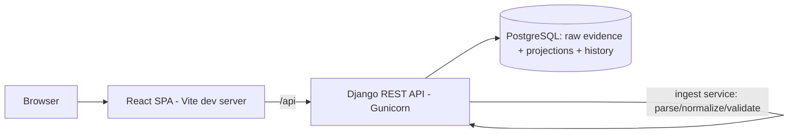

# Breathe ESG Prototype — Deployment and Operations Guide

This is the operational guide for running the ESG ingestion-and-review prototype locally. The
goal is concrete: a reviewer should have the backend running and populated with realistic data in
under ten minutes, then be able to walk a row from raw evidence to audit lock.

This guide uses the design documents' vocabulary deliberately: `RawIngestionPayload` (immutable
evidence), `NormalizedEmissionRecord` (derived projection), source-specific ingestion adapters,
the analyst review state machine, and audit locking via supersession. See [MODEL.md](MODEL.md),
[DECISIONS.md](DECISIONS.md), [TRADEOFFS.md](TRADEOFFS.md), and [SOURCES.md](SOURCES.md) for the
why behind everything here.

The canonical deployment path for the backend is **Docker Compose**. It is **provider-agnostic** —
there are no managed-service, cloud-vendor, or platform-specific assumptions anywhere in this
stack. Anything that runs the Docker Engine runs the backend identically. The React dashboard is a
Vite dev app run alongside it.

---

## 1. System Overview

The prototype ingests activity data from three source types (SAP fuel/procurement, utility
electricity, corporate travel), preserves each input as immutable evidence, derives normalized
emission projections from that evidence, and surfaces a review dashboard where an analyst inspects
what arrived and what was flagged, then approves rows — which locks them for audit.

The defining behavior, repeated here because it governs operations: **raw evidence is never edited
or deleted, and approved projections are never mutated in place.** Corrections happen by creating
new evidence or a superseding projection, never by overwriting an approved record. Both guarantees
are enforced in the Django model layer (`save`/`delete` raise), not merely by convention.

---

## 2. Architecture Summary

The runtime is deliberately small and synchronous — there is **no message broker, no worker
process, and no streaming layer** (see [DECISIONS.md](DECISIONS.md) ADR-007 and
[TRADEOFFS.md](TRADEOFFS.md) §3). Ingestion runs inside the request via a service layer, which is
sufficient for periodic emissions evidence and keeps the audit record canonical and queryable.

- **Backend (Django REST):** request handling, fail-closed tenant scoping, the ingestion service
  (`parse → normalize → validate`), the review/approval endpoint, and read queries. Served by
  Gunicorn.
- **PostgreSQL:** the single source of truth for both layers — immutable `RawIngestionPayload`
  (JSONB evidence) and derived `NormalizedEmissionRecord` (with `normalization_metadata` capturing
  each value's derivation) — plus the `django-simple-history` audit/history tables.
- **Frontend (React + Vite):** the analyst review dashboard, run as a local dev server that calls
  the backend at `VITE_API_URL`.



---

## 3. Service Topology

`docker-compose.yml` defines exactly two services. The React frontend is run separately (section
4) and is not containerized in this prototype.

| Service | Role | Depends on | Exposed |
| --- | --- | --- | --- |
| `db` | PostgreSQL 15; raw evidence, projections, and `django-simple-history` tables | — | internal (5432) |
| `web` | Django REST API; runs `migrate` on start, then Gunicorn | `db` (healthcheck) | `:8000` |

`web` waits on a Postgres healthcheck (`depends_on: condition: service_healthy`) before starting.
Persistent state lives in one named volume, `postgres_data`, for the Postgres data directory —
the database is the chain of custody, so it must survive restarts.

---

## 4. Local Development Setup

Prerequisites: Docker Engine + the Docker Compose plugin (for the backend) and Node.js (for the
dashboard).

```bash
# 1. Start Postgres + the Django API (migrations run automatically on web start)
docker compose up --build -d

# 2. Populate realistic data through the real ingestion pipeline (see section 8)
docker compose exec web python manage.py load_mock_data

# 3. Run the React dashboard
cd frontend
npm install
npm run dev
#    Dashboard: http://localhost:5173
#    API root:  http://localhost:8000/api/
```

The single-analyst session is simulated (see [DECISIONS.md](DECISIONS.md) ADR-001), so there is no
login. The dashboard opens directly into the review table; approval actions are still attributed
in the `django-simple-history` audit trail.

---

## 5. Environment Variables

All configuration is environment-driven; no secrets are committed. The defaults below are baked
into `docker-compose.yml` and are safe for local review.

Backend (read by `core/settings.py` and Compose):

| Variable | Purpose | Default |
| --- | --- | --- |
| `DATABASE_URL` | Postgres DSN (falls back to SQLite if unset, outside Compose) | `postgres://breathe_esg:breathe_esg@db:5432/breathe_esg` |
| `DATABASE_CONN_MAX_AGE` | Persistent connection lifetime (seconds) | `60` |
| `DJANGO_SECRET_KEY` | Django signing key | `local-development-only-change-me` |
| `DJANGO_DEBUG` | Debug mode | `False` |
| `DJANGO_ALLOWED_HOSTS` | Comma-separated allowed hosts | `localhost,127.0.0.1,0.0.0.0,web` |
| `TIME_ZONE` | Server timezone | `UTC` |
| `POSTGRES_DB` / `POSTGRES_USER` / `POSTGRES_PASSWORD` | `db` service credentials | `breathe_esg` |
| `DJANGO_PORT` | Host port mapped to the API | `8000` |

Frontend (`frontend/.env`):

| Variable | Purpose | Default |
| --- | --- | --- |
| `VITE_API_URL` | Base URL the dashboard calls; used as `import.meta.env.VITE_API_URL` | `http://localhost:8000` |

Operational note: inside Compose, `DATABASE_URL` uses the Docker service name `db`, not
`localhost` — containers reach each other by service name.

---

## 6. Database Initialization

The `db` service creates an empty Postgres database on first start using the `POSTGRES_*`
credentials. The data directory is the `postgres_data` named volume, so it persists across
`docker compose down`/`up`. To start completely fresh (destroying all evidence, projections, and
audit history):

```bash
docker compose down -v        # -v removes the postgres_data volume
docker compose up --build -d
```

Use `-v` only when you intend to discard the chain of custody.

---

## 7. Running Migrations

Schema is applied through Django migrations against the single shared schema (shared-schema
multi-tenancy; see [DECISIONS.md](DECISIONS.md) ADR-002 — every owned table carries `tenant_id`).
The `web` service runs `migrate` automatically on start; to run it manually:

```bash
docker compose exec web python manage.py migrate
```

Migrations are idempotent and safe to re-run. Because tenancy is shared-schema, there is exactly
one migration path for all tenants.

---

## 8. Loading Mock Data

`load_mock_data` ingests the sample files in [`mock_data/`](mock_data) through the **real
ingestion service** — not a bulk insert — so seeded rows carry the same immutable evidence,
derivation metadata, and review states a live upload would produce.

```bash
docker compose exec web python manage.py load_mock_data
# optional: --tenant-id 2   to seed a second tenant
```

The sample files are intentionally adversarial (a SAP row with `MENGE = 15000`, a `GAL` row, a
German decimal-comma value; utility bills on a `Jan 14 → Feb 12` cross-month cycle; travel
segments including an unknown airport code `XXX`). They exercise the failure and flag paths, so
after seeding the dashboard will correctly show a `FLAGGED` SAP row and the travel row with the bad
airport will be rejected with a clear error (its raw evidence is still preserved).

---

## 9. Running Ingestion Flows

There is a single ingestion endpoint. It accepts one JSON record per call, routes by `source_type`
to the matching adapter, stores immutable evidence, and creates one or more normalized projections.

```bash
# SAP fuel/procurement row (Scope 1)
curl -X POST http://localhost:8000/api/ingest/ \
  -H "Content-Type: application/json" \
  -d '{"source_type": "SAP", "payload": {"BUKRS": "1000", "WERKS": "BLR1", "MENGE": "250", "MEINS": "GAL"}}'

# Utility electricity bill (Scope 2) — cross-month bills produce one projection per month
curl -X POST http://localhost:8000/api/ingest/ \
  -H "Content-Type: application/json" \
  -d '{"source_type": "UTILITY", "payload": {"meter_identifier": "MTR-001", "start_date": "2024-01-14", "end_date": "2024-02-12", "consumption_value": "2900", "unit": "kWh"}}'

# Corporate travel segment (Scope 3)
curl -X POST http://localhost:8000/api/ingest/ \
  -H "Content-Type: application/json" \
  -d '{"source_type": "TRAVEL", "payload": {"origin_iata": "JFK", "destination_iata": "LHR"}}'

# Tenant scoping: pass X-Tenant-ID (defaults to 1 if omitted)
curl -X POST http://localhost:8000/api/ingest/ -H "X-Tenant-ID: 2" \
  -H "Content-Type: application/json" \
  -d '{"source_type": "TRAVEL", "payload": {"origin_iata": "SIN", "destination_iata": "DXB"}}'
```

What happens on submission, in order:
1. `source_type` is validated; the JSON `payload` is stored verbatim as an immutable
   `RawIngestionPayload`, hashed (`ingestion_hash`, a SHA-256 over the canonicalized payload) for
   duplicate detection.
2. The source adapter parses and normalizes: unit conversion (e.g. `GAL → L`), scope assignment,
   utility billing-period day-weighted allocation, or travel great-circle distance derivation.
3. Each resulting `NormalizedEmissionRecord` is created with `emission_factor_version = "v1"`,
   `status` of `PENDING` (or `FLAGGED`, e.g. SAP `MENGE > 10000`), and a `normalization_metadata`
   blob recording exactly how its value was derived (the conversion applied, the allocation, or the
   `distance_is_derived` flag).
4. On validation failure, the response carries `status = "FAILED"` and `errors`, but the raw
   evidence is still persisted for audit and replay.

Other endpoints:

```bash
curl http://localhost:8000/api/normalized-records/                      # review queue (tenant-scoped)
curl http://localhost:8000/api/raw-payloads/                            # immutable evidence (tenant-scoped)
curl -X PATCH http://localhost:8000/api/normalized-records/<id>/approve/  # approve -> audit-lock
```

Re-submitting an identical payload is rejected by the unique `ingestion_hash`, so the same
evidence is never double-counted.

---

## 10. Analyst Review Workflow

Open the dashboard (`http://localhost:5173`). It is an information-dense review console:

- **Summary KPIs:** cards across the top — Total Records, Pending, Flagged, Approved, and Scope
  1/2/3 — all computed client-side from the loaded records.
- **Review table:** one row per `NormalizedEmissionRecord`, columns: ID, Source, Scope, Value,
  Unit, Factor Version, Status, Updated, Action. Status is shown as a colored badge
  (PENDING amber / FLAGGED red / APPROVED green) and Scope as a colored chip. The Updated column
  shows a relative timestamp (e.g. "5 hours ago"), with the absolute time on hover.
- **Anomaly highlighting:** rows with `status = FLAGGED` get a red row treatment plus a red left
  border and a warning icon. Flags come from deterministic rules, not ML, so every flag is
  explainable (see [TRADEOFFS.md](TRADEOFFS.md) §4).
- **Approve:** rows in `PENDING` or `FLAGGED` show an Approve button (it stops row-click
  propagation). Clicking it issues `PATCH /api/normalized-records/{id}/approve/`; on success the
  row's status flips to `APPROVED` optimistically (no refetch), the highlight clears, and a brief
  success flash is shown.
- **Record detail drawer:** clicking a row opens a read-only side panel showing the record's
  source type, status, scope, value/unit, factor version, tenant, created/updated times, the full
  `normalization_metadata`, and the raw payload evidence (ingestion hash, parser version, and
  `raw_data`). The evidence is fetched on demand from the existing
  `GET /api/raw-payloads/{id}/` endpoint; close with the X button, backdrop click, or Escape.
- **Copy ID:** a copy button on each row (and in the drawer) copies the full record UUID and shows
  a toast confirmation.
- **Footer:** an "Immutable ESG Evidence Ledger" label and a tenant indicator (derived from the
  loaded records).

The table reads `source_type` and `tenant_id` directly from the normalized-record payload (the
serializer joins them from the evidence), so the queue loads in a single API call; the detail
drawer issues one additional read only when a row is opened.

---

## 11. Approval and Audit Lock Workflow

Approval is an explicit **state transition**, not a boolean flag (see [DECISIONS.md](DECISIONS.md)
ADR-008). Approving a record transitions it to `APPROVED`, which is the audit-locked terminal
state:

- The transition is performed in `ledger/services/approval.py` under `select_for_update`, and is
  captured by `django-simple-history`.
- An `APPROVED` record cannot be mutated or deleted in place — `NormalizedEmissionRecord.save`/
  `delete` raise `AuditLockedRecordError`, so even a faulty code path cannot rewrite an approved
  figure.
- To change a locked figure you **supersede** it: create a new projection from the unchanged
  evidence. The prior figure and its history remain, so a correction reads as an explainable
  restatement rather than a silent overwrite.

Cross-tenant safety: approval is routed through the tenant-scoped queryset, so approving a record
belonging to another tenant returns `404`, not success.

Record-level history (who/when/what changed) is available via the `history` relation on
`NormalizedEmissionRecord` (e.g. in the Django admin or shell); a dedicated audit API endpoint is
a future extension (section 13).

---

## 12. Troubleshooting

| Symptom | Likely cause | Resolution |
| --- | --- | --- |
| `web` exits on startup, can't reach DB | `db` not ready | Compose waits on the healthcheck, but on a cold first build you can `docker compose restart web`. Confirm with `docker compose ps`. |
| Migrations error: relation does not exist | Migrations not run | `docker compose exec web python manage.py migrate` |
| Dashboard table is empty | Mock data not loaded | `docker compose exec web python manage.py load_mock_data` |
| Dashboard shows a network/error state | `VITE_API_URL` wrong, or API not running | Confirm `frontend/.env` points at `http://localhost:8000` and `docker compose ps` shows `web` up. |
| A SAP row shows up as `FLAGGED` | `MENGE > 10000` threshold tripped | Expected; review and approve it. |
| A travel payload returns an error | Unknown/missing IATA code (only `JFK`, `LHR`, `FRA`, `SIN`, `DXB` are known) | Expected; the raw evidence is still stored. See [SOURCES.md](SOURCES.md) §3. |
| SAP quantity looks 1000x off | Decimal-comma vs. dot locale ambiguity | Confirm the source locale; see [SOURCES.md](SOURCES.md) §1. |
| Utility usage split across two rows | Day-weighted allocation of a cross-month bill | Expected; see [SOURCES.md](SOURCES.md) §2 and `normalization_metadata`. |
| Can't change an approved row | Record is audit-locked | Intended. Supersede it (section 11); there is no unlock-and-edit. |
| Duplicate ingest rejected | Unique `ingestion_hash` | Expected; identical payloads are not double-counted. |
| Need a clean slate | Stale volume | `docker compose down -v && docker compose up --build -d`, then re-run sections 7–8. |

Logs for a service: `docker compose logs -f web` (or `db`).

---

## 13. Future Extensions

These are deliberately **not** in the prototype; each fits the existing architecture without
reworking the evidence/projection split. See [TRADEOFFS.md](TRADEOFFS.md) for the full reasoning.

- **Real provider connectors** (SAP OData/BAPI, utility/aggregator APIs, Concur/Navan API pull):
  add API-pull adapters that emit the *same* `RawIngestionPayload` shape as the file/JSON adapters,
  so live and file ingestion converge on one pipeline. (TRADEOFFS §2.)
- **File-upload ingestion** (multipart CSV) layered over the existing JSON `POST /api/ingest/`,
  storing the original artifact alongside the parsed evidence. (SOURCES.md.)
- **Authentication and authorization** (JWT/SSO, RBAC, maker-checker segregation): populate the
  already-attributed actor identity from a real session; enforce maker ≠ checker on the existing
  review transitions. (DECISIONS ADR-001, TRADEOFFS §5.)
- **A dedicated audit/lineage API endpoint** surfacing `django-simple-history` and the
  raw-payload → projection lineage as JSON for the dashboard. (MODEL §5–§6.)
- **Asynchronous ingestion** (a worker tier) only if batch sizes outgrow request-time processing;
  the ingestion service is already a standalone, replayable callable. (TRADEOFFS §3.)
- **Advisory ML anomaly detection** that raises candidates into the existing deterministic
  rule-flag UI with human-readable explanations — recall, not an autonomous gate. (TRADEOFFS §4.)
- **Stronger tenant isolation** (schema-per-tenant or database-per-tenant) for clients whose
  regulatory posture requires physical separation; no data-model change is needed because
  `tenant_id` already exists on every owned table. (DECISIONS ADR-002.)
- **Market-based Scope 2 and activity-based Scope 3**, plus CO2e computation from a versioned
  factor library, as additional projections over the same evidence — enabled by replay and
  `emission_factor_version`. (MODEL §7–§8.)
